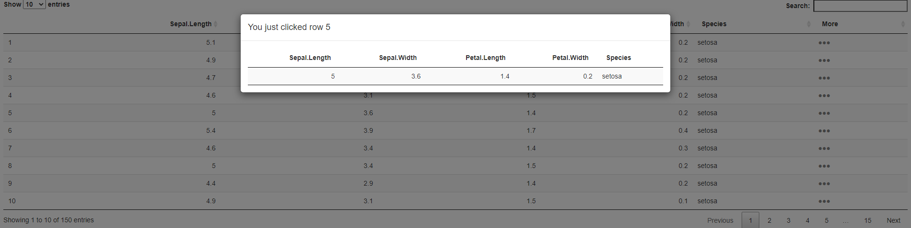

# DataTable Overlay
Sometimes there are too many rows in a data table to display on one page and scrolling is not the most user-friendly way to solve this. This examples provides a way to layer information into a overlay which can be accessed by clicking a link in a data table. 

You can try out the app [here](https://shiny.epi-interactive.com/modal)



## How it works
Add an an extra column for the data in your table and attach a Shiny event listener to it to return its index

``` r
dat <- dat %>%
  mutate(More = paste0('
  <span style="float:right;">
    <a href="javascript:void(0)" onmousedown="',
             'Shiny.onInputChange(\'DTClick\',[', GID, ',Math.random()]);',
             ' event.preventDefault(); event.stopPropagation(); return false;">
                <font color="grey">&#9679;&#9679;&#9679;&nbsp;&nbsp;</font>
    </a>
  </span>')
)
    

```

Listen for the click and show the overlay
``` r
observeEvent(input$DTClick, {
      showModal(modalDialog(
        title = "Sample message",
        div(HTML(paste0("You just clicked row ", as.numeric(input$DTClick[1]))),
            uiOutput("modalContent")),
        easyClose = TRUE,
        footer = NULL
      ))
    })
```
